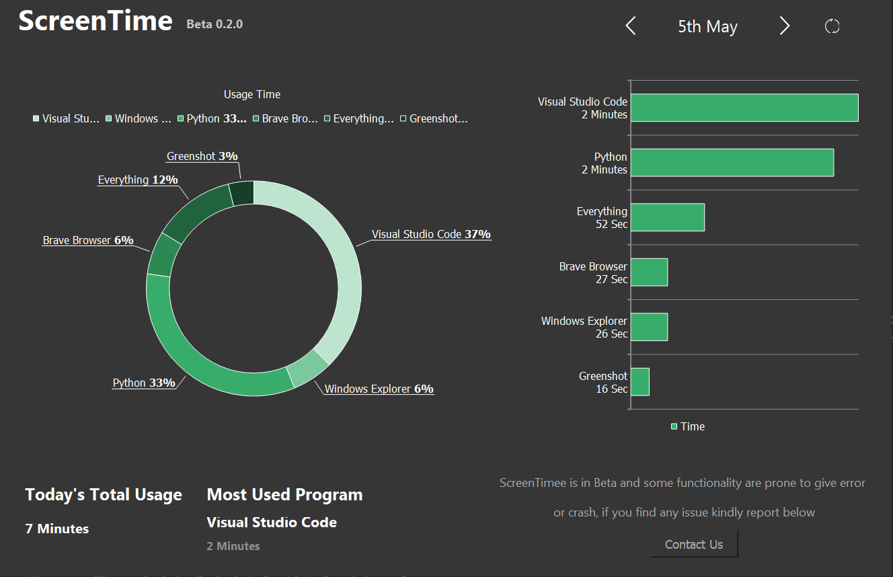

# ScreenTime

Free software to track your software usage and Screen time in windows!

## Screenshot

## Features
- track each software opened and closed
- usage of each software in mins and hours
- Great UI and animation
- simple software and clean interface

## Download installer
download the simple **ScreentimeIntaller.exe**

